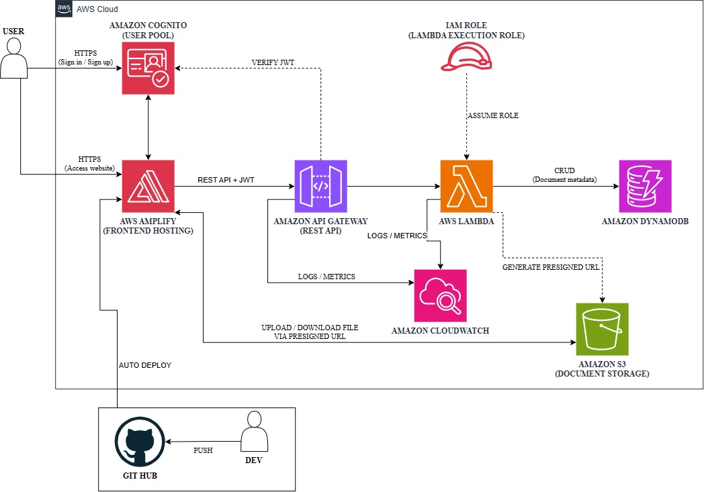

# Serverless Document Management System
## A Unified AWS Serverless Solution for Secure Document Storage and Management

### 1. Executive Summary
The Serverless Document Management System (DMS) is a web platform that allows employees and members of an organization to upload, store, find, and download documents (PDF, DOCX, images, etc.) securely from anywhere. The whole system is built on AWS serverless services: AWS Amplify hosts the React/Next.js frontend, Amazon Cognito handles authentication, Amazon API Gateway and AWS Lambda implement the business logic, Amazon S3 stores the document files, and Amazon DynamoDB stores document metadata. Amazon CloudWatch provides monitoring and logging. The platform requires no servers to manage and is designed to run at a very low monthly cost.

### 2. Problem Statement
### What's the Problem?
Documents are often scattered across personal computers, messaging apps, and email, which makes them hard to find and easy to lose. There is no single place to store them, no consistent control over who can view or change a file, and no clear record of who owns which document. Traditional solutions require running and maintaining a dedicated server, while commercial document platforms are costly and more complex than a small team needs.

### The Solution
Amazon Cognito authenticates users and issues JWT tokens. Every request from the web app hosted on AWS Amplify goes through Amazon API Gateway, which verifies the token with a Cognito authorizer before invoking AWS Lambda. Lambda validates the request, manages document metadata in Amazon DynamoDB, and generates short-lived pre-signed URLs so the browser can upload and download files directly to and from Amazon S3. This keeps large files out of API Gateway and Lambda payloads, which improves performance and lowers cost. Lambda runs with a least-privilege IAM role, Amazon CloudWatch collects logs, metrics, and alarms from API Gateway and Lambda, and the GitHub integration lets AWS Amplify deploy the frontend automatically on every push. Key features include secure sign-in, document upload and download, metadata management (owner, tags, file name, type, size, timestamps), and access control.

### Benefits and Return on Investment
The solution gives users a single, secure place to manage documents, reduces the time spent searching for files, and provides a reusable serverless foundation for future extensions such as full-text search, document versioning, or AI-based document analysis. It also serves as a hands-on study resource for core AWS serverless services. Every service is pay-per-use and there is no hardware or licence to buy, so the estimated running cost is about $0.94 USD per month, or $11.28 USD for 12 months, based on the assumptions in Section 6, and much of it falls within the AWS Free Tier. With no upfront investment, the return comes from time saved, better document security, and automatic scaling if usage grows.

### 3. Solution Architecture
The platform follows a serverless AWS architecture. Users access a web app hosted on AWS Amplify and sign in through Amazon Cognito. Requests pass through Amazon API Gateway to AWS Lambda, which manages metadata in Amazon DynamoDB and issues pre-signed URLs for files stored in Amazon S3. Amazon CloudWatch monitors the system, and GitHub with AWS Amplify provides automated frontend deployment. The architecture is detailed below:

**Request Flow**
1. The user opens the web app hosted on AWS Amplify over HTTPS.
2. The user signs in or registers through Amazon Cognito and receives a JWT token.
3. The web app sends REST API requests with the JWT to Amazon API Gateway.
4. API Gateway verifies the token with the Cognito authorizer and invokes AWS Lambda.
5. Lambda validates the request and creates, reads, updates, or deletes metadata in Amazon DynamoDB.
6. For uploads and downloads, Lambda generates a pre-signed URL using its IAM role and returns it through API Gateway.
7. The browser uploads or downloads the file directly to or from Amazon S3 using the pre-signed URL.
8. API Gateway and Lambda send logs and metrics to Amazon CloudWatch.

### AWS Services Used
- **AWS Amplify**: Hosts the React/Next.js web frontend and deploys it automatically from GitHub.
- **Amazon Cognito**: Handles user registration, sign-in, and JWT-based authentication.
- **Amazon API Gateway**: Exposes the REST API and authorizes requests with a Cognito authorizer.
- **AWS Lambda**: Runs the business logic: request validation, metadata management, and pre-signed URL generation.
- **Amazon S3**: Stores document files (PDF, DOCX, images, etc.) in a private bucket.
- **Amazon DynamoDB**: Stores document metadata such as owner, tags, file name, type, size, timestamps, and access control information.
- **Amazon CloudWatch**: Collects logs, metrics, and alarms from API Gateway and Lambda.
- **AWS IAM**: Provides least-privilege roles and policies for Lambda and other resources.

### Component Design
- **Web Frontend**: A React/Next.js app on AWS Amplify where users sign in, upload, browse, search, and download documents.
- **Authentication**: Amazon Cognito user pool manages users and issues JWT tokens; user groups can be used for role-based access.
- **API Layer**: Amazon API Gateway receives requests from the frontend and rejects any request without a valid token.
- **Business Logic**: AWS Lambda functions handle document operations and generate pre-signed URLs.
- **File Storage**: Amazon S3 stores document files; the browser transfers files directly using pre-signed URLs.
- **Metadata Storage**: Amazon DynamoDB stores one item per document for fast lookup by owner, name, or tag.
- **Monitoring**: Amazon CloudWatch provides centralized logs, metrics, and alarms.
- **CI/CD**: A push to GitHub triggers AWS Amplify to build and deploy the frontend.

### 4. Technical Implementation
**Implementation Phases**
The project has four phases:
- Research and Design: Study the AWS serverless services involved and draw the architecture (Weeks 1-2).
- Calculate Cost and Check Feasibility: Use the AWS Pricing Calculator to estimate costs and confirm the design fits the requirements (Week 3).
- Refine Architecture: Adjust the design for security, cost, and usability, for example the DynamoDB data model and IAM policies (Weeks 4-5).
- Develop, Test, and Deploy: Build the backend and frontend, test all document operations, and deploy to production (Weeks 6-12).

**Technical Requirements**
- **Frontend**: React/Next.js app hosted on AWS Amplify, connected to a GitHub repository for automatic build and deploy.
- **Authentication**: Cognito user pool with sign-up, sign-in, and a Cognito authorizer on API Gateway.
- **API**: REST endpoints served by API Gateway and Lambda, for example:
    - `POST /documents`: create metadata and return an upload URL.
    - `GET /documents`: list or search the user's documents.
    - `GET /documents/{id}`: get metadata and a download URL.
    - `PUT /documents/{id}`: update metadata.
    - `DELETE /documents/{id}`: delete the document and its metadata.
- **Metadata Model**: A DynamoDB table with one item per document (document ID, owner, tags, file name, type, size, S3 key, created and updated timestamps, access control attributes).
- **Storage**: A private S3 bucket with Block Public Access enabled, server-side encryption, and a CORS rule that allows the web app to use pre-signed URLs, with short URL expiry (for example 5-15 minutes).
- **Security**: A least-privilege IAM role for Lambda limited to the required S3 and DynamoDB actions.
- **Monitoring**: CloudWatch log groups for API Gateway and Lambda, plus alarms for errors and unusual usage.

### 5. Timeline & Milestones
**Project Timeline**
- Weeks 1-2: Research AWS serverless services and design the architecture.
- Week 3: Estimate cost with the AWS Pricing Calculator and check feasibility.
- Weeks 4-5: Refine the architecture (data model, security, cost).
- Weeks 6-10: Implement authentication, API, Lambda functions, DynamoDB, S3, and the frontend; test each feature.
- Weeks 11-12: Deploy, set up monitoring, finalize documentation, and present the final demo.

### 6. Budget Estimation

### Infrastructure Costs
- AWS Services:
    - AWS Lambda: 
    - Amazon API Gateway: 
    - Amazon DynamoDB:
    - Amazon S3 Standard: 
    - Amazon Cognito:
    - AWS Amplify Hosting:
    - Amazon CloudWatch:
    - Data Transfer: 

Total: 

- Hardware: 

### 7. Risk Assessment
#### Risk Matrix
- Unauthorized Access: High impact, low probability.
- Accidental Deletion or Data Loss: High impact, low probability.
- Cost Overruns: Medium impact, low probability.
- Misconfiguration (CORS, IAM, API Gateway): Medium impact, medium probability.
- Service Limits and Lambda Cold Starts: Low impact, medium probability.

#### Mitigation Strategies
- Access: Cognito authentication, Cognito authorizer, private S3 bucket, least-privilege IAM, and short-lived pre-signed URLs.
- Data Loss: Enable S3 versioning and restrict delete permissions.
- Cost: AWS Budgets alerts and CloudWatch alarms; keep resources on pay-per-use.
- Misconfiguration: Test each integration step by step and review IAM and CORS settings before release.
- Performance: Use pre-signed URLs to keep large files out of API Gateway and Lambda payload limits, and keep functions small.

#### Contingency Plans
- Roll back the frontend to a previous build in AWS Amplify if a deployment fails.
- Use an infrastructure-as-code template (such as AWS SAM or CloudFormation) to redeploy or remove the backend stack quickly.
- Restore documents from previous S3 object versions if files are deleted or overwritten by mistake.

### 8. Expected Outcomes
#### Technical Improvements:
A centralized, secure platform replaces scattered document storage, with authenticated access, searchable metadata, and direct, efficient file transfer.  
The serverless design scales automatically without server maintenance.
#### Long-term Value
A reusable serverless foundation that can be extended with full-text search, document versioning, sharing, notifications, or AI-based analysis.  
A practical reference project for building secure, low-cost applications on AWS.